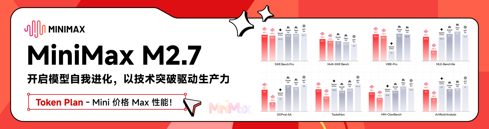

<div align="center">

# CC Switch (Fork)

基于 [farion1231/cc-switch](https://github.com/farion1231/cc-switch)，已同步至上游 v3.12.3。

**个人自用修改版，主打能用就行。** 新增或修改的功能未经充分测试，**可能存在 bug 或与上游不兼容**，介意请使用[官方版](https://github.com/farion1231/cc-switch)。

[](https://github.com/kongkongyo/cc-switch/releases)
[](https://github.com/kongkongyo/cc-switch/releases)
[](https://tauri.app/)

[English](README_EN.md) | 中文 | [日本語](README_JA.md) | [更新日志](CHANGELOG.md)

</div>

## 与上游的主要差异

这个仓库不是“只改几个 patch 的镜像”，而是一个持续跟随上游的长期 fork。下面列的是后续同步时最需要留意的几条主线，便于快速判断哪些改动不能被上游直接覆盖。

- Claude 路由与故障转移扩展：增加了按模型族分流、模型级健康状态、模型级故障转移队列、混合故障转移链等能力。对应后端实现集中在 `src-tauri/src/database/dao/fork_proxy.rs` 及相关 `fork_` 数据表、`src-tauri/src/proxy/provider_router.rs`、`src-tauri/src/proxy/forwarder.rs`。
- Fork 数据隔离：fork 自有的路由/健康状态/设置尽量放在独立附加数据库或 `fork_` 命名空间里，减少与上游 schema 迁移的直接冲突。这部分同步时不要轻易并回上游主表。
- 托管认证与 GitHub Copilot 集成：新增了 Auth Center、GitHub Copilot OAuth、多账号选择、provider 绑定托管认证源等能力，涉及 `src-tauri/src/commands/auth.rs`、`src-tauri/src/commands/copilot.rs`、`src-tauri/src/proxy/providers/copilot_auth.rs`、`src/components/settings/AuthCenterPanel.tsx` 等一组文件。
- 主窗口与深链接生命周期：托盘左键切换主窗口显示/隐藏、Windows 最小化到托盘时隐藏任务栏、主窗口改为“先隐藏，再延时 3000ms 销毁，重新显示时取消旧销毁任务”，同时深链接在窗口未就绪时会缓冲并在前端 ready 后重放。相关逻辑集中在 `src-tauri/src/main_window.rs`、`src-tauri/src/lib.rs`、`src-tauri/src/tray.rs`、`src-tauri/src/store.rs`、`src/components/DeepLinkImportDialog.tsx`。
- 自用 UI/交互增强：包括供应商卡片显示当前模型名、`ModelSuggest` 建议输入、恢复测试参数配置、测试提示词池、供应商右键置顶/置底、新增供应商默认插入第二位等。这些改动大多散落在 `src/components/providers/`、`src/config/` 与相关 hooks 中。

上面不是完整清单，但已经覆盖了后续同步最容易冲突、最不适合直接“以远端为准”覆盖的区域。

## 同步上游时请注意

- 推荐流程：先 `git fetch`，再 fast-forward 或 merge 上游，再单独回看上面提到的 fork 热点文件，最后至少执行一次 `pnpm tauri build --no-bundle`。
- 版本号和发布资料要一起看：`package.json`、`src-tauri/Cargo.toml`、`src-tauri/tauri.conf.json`、`.github/workflows/release.yml`、`CHANGELOG.md`、README 徽章与版本文案最好在同一轮同步里一起调整。
- 如果上游改到了 provider/proxy/schema 相关文件，不要只解决文本冲突；要同时检查 fork 的 `fork_` 表、路由设置、健康状态读写、前端开关和测试是否仍然对应。
- 如果上游改到了托盘、窗口或 deep-link 逻辑，要额外检查本 fork 的隐藏后延时销毁、任务栏可见性、窗口 ready 状态与 deep-link 缓冲是否还成立。
- 如果新增了新的 fork 专属模块，请同步更新本节和根目录 `AGENTS.md`，避免下一次同步时只能靠 `git log` 反推本仓库差异。
---

## ❤️赞助商

[](https://platform.minimaxi.com/subscribe/coding-plan?code=7kYF2VoaCn&source=link)

MiniMax M2.7 是 MiniMax 首个深度参与自我迭代的模型，可自主构建复杂 Agent Harness，并基于 Agent Teams、复杂 Skills、Tool Search Tool 等能力完成高复杂度生产力任务；其在软件工程、端到端项目交付及办公场景中表现优异，多项评测接近行业领先水平，同时具备稳定的复杂任务执行、环境交互能力以及良好的情商与身份保持能力。

[点击此处](https://platform.minimaxi.com/subscribe/coding-plan?code=7kYF2VoaCn&source=link)享 MiniMax Token Plan 专属 88 折优惠！

---

<table>
<tr>
<td width="180"><a href="https://www.packyapi.com/register?aff=cc-switch"></a></td>
<td>感谢 PackyCode 赞助了本项目！PackyCode 是一家稳定、高效的API中转服务商，提供 Claude Code、Codex、Gemini 等多种中转服务。PackyCode 为本软件的用户提供了特别优惠，使用<a href="https://www.packyapi.com/register?aff=cc-switch">此链接</a>注册并在充值时填写"cc-switch"优惠码，首次充值可以享受9折优惠！</td>
</tr>

<tr>
<td width="180"><a href="https://aigocode.com/invite/CC-SWITCH"></a></td>
<td>感谢 AIGoCode 赞助了本项目！AIGoCode 是一个集成了 Claude Code、Codex 以及 Gemini 最新模型的一站式平台，为你提供稳定、高效且高性价比的AI编程服务。本站提供灵活的订阅计划，零封号风险，国内直连，无需魔法，极速响应。AIGoCode 为 CC Switch 的用户提供了特别福利，通过<a href="https://aigocode.com/invite/CC-SWITCH">此链接</a>注册的用户首次充值可以获得额外10%奖励额度！</td>
</tr>

<tr>
<td width="180"><a href="https://www.aicodemirror.com/register?invitecode=9915W3"></a></td>
<td>感谢 AICodeMirror 赞助了本项目！AICodeMirror 提供 Claude Code / Codex / Gemini CLI 官方高稳定中转服务，支持企业级高并发、极速开票、7×24 专属技术支持。
Claude Code / Codex / Gemini 官方渠道低至 3.8 / 0.2 / 0.9 折，充值更有折上折！AICodeMirror 为 CCSwitch 的用户提供了特别福利，通过<a href="https://www.aicodemirror.com/register?invitecode=9915W3">此链接</a>注册的用户，可享受首充8折，企业客户最高可享 7.5 折！</td>
</tr>

<tr>
<td width="180"><a href="https://cubence.com/signup?code=CCSWITCH&source=ccs"></a></td>
<td>感谢 Cubence 赞助本项目！Cubence 是一家可靠高效的 API 中继服务提供商，提供对 Claude Code、Codex、Gemini 等模型的中继服务，并提供按量、包月等灵活的计费方式。Cubence 为 CC Switch 的用户提供了特别优惠：使用 <a href="https://cubence.com/signup?code=CCSWITCH&source=ccs">此链接</a> 注册，并在充值时输入 "CCSWITCH" 优惠码，每次充值均可享受九折优惠！</td>
</tr>

<tr>
<td width="180"><a href="https://www.dmxapi.cn/register?aff=bUHu"></a></td>
<td>感谢 DMXAPI（大模型API）赞助了本项目！ DMXAPI，一个Key用全球大模型。
为200多家企业用户提供全球大模型API服务。· 充值即开票 ·当天开票 ·并发不限制  ·1元起充 ·  7x24 在线技术辅导，GPT/Claude/Gemini全部6.8折，国内模型5~8折，Claude Code 专属模型3.4折进行中！<a href="https://www.dmxapi.cn/register?aff=bUHu">点击这里注册</a></td>
</tr>

<tr>
<td width="180"><a href="https://www.right.codes/register?aff=CCSWITCH"></a></td>
<td>感谢 Right Code 赞助了本项目！Right Code 稳定提供 Claude Code、Codex、Gemini 等模型的中转服务。主打<strong>极高性价比</strong>的Codex包月套餐，<strong>提供额度转结，套餐当天用不完的额度，第二天还能接着用！</strong>充值即可开票，企业、团队用户一对一对接。同时为 CC Switch 的用户提供了特别优惠：通过<a href="https://www.right.codes/register?aff=CCSWITCH">此链接</a>注册，每次充值均可获得实付金额25%的按量额度！</td>
</tr>

<tr>
<td width="180"><a href="https://aicoding.sh/i/CCSWITCH"></a></td>
<td>感谢 AICoding.sh 赞助了本项目！AICoding.sh —— 全球大模型 API 超值中转服务！Claude Code 1.9 折，GPT 0.1 折，已为数百家企业提供高性价比 AI 服务。支持 Claude Code、GPT、Gemini 及国内主流模型，企业级高并发、极速开票、7×24 专属技术支持，通过<a href="https://aicoding.sh/i/CCSWITCH">此链接</a> 注册的 CC Switch 用户，首充可享受九折优惠！</td>
</tr>

<tr>
<td width="180"><a href="https://crazyrouter.com/register?aff=OZcm&ref=cc-switch"></a></td>
<td>感谢 Crazyrouter 赞助了本项目！Crazyrouter 是一个高性能 AI API 聚合平台——一个 API Key 即可访问 300+ 模型，包括 Claude Code、Codex、Gemini CLI 等。全部模型低至官方定价的 55%，支持自动故障转移、智能路由和无限并发。Crazyrouter 为 CC Switch 用户提供了专属优惠：通过<a href="https://crazyrouter.com/register?aff=OZcm&ref=cc-switch">此链接</a>注册即可获得 <strong>$2 免费额度</strong>，首次充值时输入优惠码 `CCSWITCH` 还可获得额外 <strong>30% 奖励额度</strong>！</td>
</tr>

<tr>
<td width="180"><a href="https://www.sssaicode.com/register?ref=DCP0SM"></a></td>
<td>感谢 SSSAiCode 赞助了本项目！SSSAiCode 是一家稳定可靠的API中转站，致力于提供稳定、可靠、平价的Claude、CodeX模型服务，<strong>提供高性价比折合0.5￥/$的官方Claude服务</strong>，支持包月、Paygo多种计费方式、支持当日快速开票，SSSAiCode为本软件的用户提供特别优惠，使用<a href="https://www.sssaicode.com/register?ref=DCP0SM">此链接</a>注册每次充值均可享受10$的额外奖励！</td>
</tr>

</table>

## 界面预览

|                  主界面                   |                  添加供应商                  |
| :---------------------------------------: | :------------------------------------------: |
|  |  |

## 功能特性

### 当前版本：v3.12.3-fork.1 | [完整更新日志](CHANGELOG.md) | [发布说明](docs/release-notes/v3.12.3-zh.md)

**本 Fork 重点增强**

- **长期跟随上游的深度 fork**：不是只补几个 patch 的镜像，而是持续同步上游并保留本仓库自己的代理、认证、窗口生命周期和 UI 交互分支。
- **Claude 路由与故障转移扩展**：支持模型级路由、模型级故障转移队列、健康状态追踪、混合故障转移链，以及代理实际生效供应商高亮。
- **托管认证与 GitHub Copilot 集成**：新增 Auth Center、GitHub Copilot OAuth、多账号管理、供应商绑定托管凭据、Copilot 专用用量查询和代理转发能力。
- **主窗口与深链接生命周期重做**：托盘左键显示/隐藏主窗口，窗口关闭改为“先隐藏，再延时销毁”，并对 deep link 做未就绪缓冲与前端 ready 后重放。
- **自用 UI / 交互增强**：供应商卡片显示当前模型名、支持右键一键置顶/置底、恢复测试参数配置、测试提示词池、当前供应商状态与故障转移提示更清晰。
- **持久化与同步架构升级**：采用 SQLite + JSON 双层存储，支持导入导出、备份轮换、Skills/Prompts/MCP 管理和 WebDAV 同步。

**v3.12.3-fork.1 版本亮点**

- **GitHub Copilot 反向代理 + Auth Center**：在供应商体系内接入 Copilot，支持 OAuth Device Flow、多账号选择、自动刷新 Token、模型列表和用量查询。
- **macOS 代码签名、公证与 DMG 安装**：release 工作流新增 Apple 签名、公证和装订校验，macOS 用户可直接安装，无需再处理 `xattr` 等绕过步骤。
- **Reasoning Effort / Tool Search / 自动升级控制**：为 OpenAI o 系列与 GPT-5+ 增加 reasoning effort 映射；Claude 通用配置支持 `ENABLE_TOOL_SEARCH` 与 `DISABLE_AUTOUPDATER` 开关；Codex 增加 1M 上下文窗口一键开关。
- **OpenCode SQLite 后端**：OpenCode 会话支持 SQLite 存储，与原 JSON 后端并存；ID 冲突时 SQLite 优先，并补齐原子删除与路径校验。
- **Skill 生命周期增强**：Skills 卸载前自动备份，可列表、恢复、删除；同时优化缓存更新策略，减少闪烁和重复刷新。
- **代理与兼容性修复**：非流式代理自动协商 gzip，o1/o3/o4-mini 正确使用 `max_completion_tokens`，并修复 WebDAV 密码被静默清空、工具消息解析、暗色模式、Ghostty 会话恢复、供应商表单重复提交等问题。

**main 分支近期补充（尚未单独发版）**

- **主窗口 `Ctrl+V` / `Cmd+V` 快捷新增供应商**：在供应商列表页直接从剪贴板提取 URL、API Key 和域名，自动打开新增面板并预填表单。
- **剪贴板解析更稳健**：支持带 `令牌：`、`key:`、`api:` 等标签的文本，优先提取合法 URL 和 `sk-...` 风格的 API Key。
- **供应商列表更紧凑**：收缩了列表卡片、空状态和搜索反馈区留白；供应商卡片垂直高度也进一步下调，更适合笔记本屏幕一屏浏览。

**核心功能**

- **多应用供应商管理**：一键切换 Claude Code、Codex、Gemini、OpenCode 与 OpenClaw 的 API 配置。
- **代理接管与自动故障转移**：支持代理模式、供应商队列、健康检查、自动切换，以及 Claude 模型级路由。
- **MCP / Skills / Prompts 一体化管理**：统一管理各应用的 MCP 服务器、Skills 仓库安装和系统提示词预设。
- **深链接、导入导出与云同步**：支持 `ccswitch://` 导入、配置备份恢复、WebDAV 同步和自定义配置目录。
- **AWS Bedrock 与多供应商预设**：内置 Bedrock、聚合平台和多家合作伙伴预设，支持 AKSK、API Key、跨区域推理和 OpenAI 兼容端点。
- **测速、用量查询与国际化**：支持端点测速、用量脚本/模板、完整中英日文案，以及托盘与设置联动。

**系统功能**

- 系统托盘快速切换
- 单实例守护
- 内置自动更新器
- 原子写入与回滚保护

## 下载安装

### 系统要求

- **Windows**: Windows 10 及以上
- **macOS**: macOS 12 (Monterey) 及以上
- **Linux**: Ubuntu 22.04+ / Debian 11+ / Fedora 34+ 等主流发行版

### Windows 用户

从 [Releases](../../releases) 页面下载最新版本的 `CC-Switch-v{版本号}-Windows.msi` 安装包或者 `CC-Switch-v{版本号}-Windows-Portable.zip` 绿色版。

### macOS 用户

**方式一：通过 Homebrew 安装（推荐）**

```bash
brew tap farion1231/ccswitch
brew install --cask cc-switch
```

更新：

```bash
brew upgrade --cask cc-switch
```

**方式二：手动下载**

从 [Releases](../../releases) 页面下载 `CC-Switch-v{版本号}-macOS.dmg`（推荐）或 `.zip`。

> **注意**：CC Switch macOS 版本已通过 Apple 代码签名和公证，可直接安装打开。

### ArchLinux 用户

**通过 paru 安装（推荐）**

```bash
paru -S cc-switch-bin
```

### Linux 用户

从 [Releases](../../releases) 页面下载最新版本的 Linux 安装包：

- `CC-Switch-v{版本号}-Linux.deb`（Debian/Ubuntu）
- `CC-Switch-v{版本号}-Linux.rpm`（Fedora/RHEL/openSUSE）
- `CC-Switch-v{版本号}-Linux.AppImage`（通用）
- `CC-Switch-v{版本号}-Linux.flatpak`（Flatpak）

Flatpak 安装与运行：

```bash
flatpak install --user ./CC-Switch-v{版本号}-Linux.flatpak
flatpak run com.ccswitch.desktop
```

## 快速开始

### 基本使用

1. **添加供应商**：点击"添加供应商" → 选择预设或创建自定义配置
2. **切换供应商**：
   - 主界面：选择供应商 → 点击"启用"
   - 系统托盘：直接点击供应商名称（立即生效）
3. **生效方式**：重启终端或 Claude Code / Codex / Gemini 客户端以应用更改
4. **恢复官方登录**：选择"官方登录"预设（Claude/Codex）或"Google 官方"预设（Gemini），重启对应客户端后按照其登录/OAuth 流程操作

### MCP 管理

- **位置**：点击右上角"MCP"按钮
- **添加服务器**：
  - 使用内置模板（mcp-fetch、mcp-filesystem 等）
  - 支持 stdio / http / sse 三种传输类型
  - 为不同应用配置独立的 MCP 服务器
- **启用/禁用**：切换开关以控制哪些服务器同步到 live 配置
- **同步**：启用的服务器自动同步到各应用的 live 文件
- **导入/导出**：支持从 Claude/Codex/Gemini 配置文件导入现有 MCP 服务器

### Skills 管理（v3.7.0 新增）

- **位置**：点击右上角"Skills"按钮
- **发现技能**：
  - 自动扫描预配置的 GitHub 仓库（Anthropic 官方、ComposioHQ、社区等）
  - 添加自定义仓库（支持子目录扫描）
- **安装技能**：点击"安装"一键安装到 `~/.claude/skills/`
- **卸载技能**：点击"卸载"安全移除并清理状态
- **管理仓库**：添加/删除自定义 GitHub 仓库

### Prompts 管理（v3.7.0 新增）

- **位置**：点击右上角"Prompts"按钮
- **创建预设**：
  - 创建无限数量的系统提示词预设
  - 使用 Markdown 编辑器编写提示词（语法高亮 + 实时预览）
- **切换预设**：选择预设 → 点击"激活"立即应用
- **同步机制**：
  - Claude: `~/.claude/CLAUDE.md`
  - Codex: `~/.codex/AGENTS.md`
  - Gemini: `~/.gemini/GEMINI.md`
- **保护机制**：切换前自动保存当前提示词内容，保留手动修改

### 配置文件

**Claude Code**

- Live 配置：`~/.claude/settings.json`（或 `claude.json`）
- API key 字段：`env.ANTHROPIC_AUTH_TOKEN` 或 `env.ANTHROPIC_API_KEY`
- MCP 服务器：`~/.claude.json` → `mcpServers`

**Codex**

- Live 配置：`~/.codex/auth.json`（必需）+ `config.toml`（可选）
- API key 字段：`auth.json` 中的 `OPENAI_API_KEY`
- MCP 服务器：`~/.codex/config.toml` → `[mcp_servers]` 表

**Gemini**

- Live 配置：`~/.gemini/.env`（API Key）+ `~/.gemini/settings.json`（保存认证模式）
- API key 字段：`.env` 文件中的 `GEMINI_API_KEY` 或 `GOOGLE_GEMINI_API_KEY`
- 环境变量：支持 `GOOGLE_GEMINI_BASE_URL`、`GEMINI_MODEL` 等自定义变量
- MCP 服务器：`~/.gemini/settings.json` → `mcpServers`
- 托盘快速切换：每次切换供应商都会重写 `~/.gemini/.env`，无需重启 Gemini CLI 即可生效

**CC Switch 存储（v3.8.0 新架构）**

- 数据库（SSOT）：`~/.cc-switch/cc-switch.db`（SQLite，存储供应商、MCP、Prompts、Skills）
- 本地设置：`~/.cc-switch/settings.json`（设备级设置）
- 备份：`~/.cc-switch/backups/`（自动轮换，保留 10 个）
- 技能备份：`~/.cc-switch/skill-backups/`（卸载前自动创建，保留最近 20 个）

### 云同步设置

1. 前往设置 → "自定义配置目录"
2. 选择您的云同步文件夹（Dropbox、OneDrive、iCloud、坚果云等）
3. 重启应用以应用
4. 在其他设备上重复操作以启用跨设备同步

> **注意**：首次启动会自动导入现有 Claude/Codex 配置作为默认供应商。

## 架构总览

### 设计原则

```
┌─────────────────────────────────────────────────────────────┐
│                    前端 (React + TS)                         │
│  ┌─────────────┐  ┌──────────────┐  ┌──────────────────┐    │
│  │ Components  │  │    Hooks     │  │  TanStack Query  │    │
│  │   （UI）     │──│ （业务逻辑）   │──│   （缓存/同步）    │    │
│  └─────────────┘  └──────────────┘  └──────────────────┘    │
└────────────────────────┬────────────────────────────────────┘
                         │ Tauri IPC
┌────────────────────────▼────────────────────────────────────┐
│                  后端 (Tauri + Rust)                         │
│  ┌─────────────┐  ┌──────────────┐  ┌──────────────────┐    │
│  │  Commands   │  │   Services   │  │  Models/Config   │    │
│  │ （API 层）   │──│  （业务层）    │──│    （数据）       │    │
│  └─────────────┘  └──────────────┘  └──────────────────┘    │
└─────────────────────────────────────────────────────────────┘
```

**核心设计模式**

- **SSOT**（单一事实源）：所有数据存储在 `~/.cc-switch/cc-switch.db`（SQLite）
- **双层存储**：SQLite 存储可同步数据，JSON 存储设备级设置
- **双向同步**：切换时写入 live 文件，编辑当前供应商时从 live 回填
- **原子写入**：临时文件 + 重命名模式防止配置损坏
- **并发安全**：Mutex 保护的数据库连接避免竞态条件
- **分层架构**：清晰分离（Commands → Services → DAO → Database）

**核心组件**

- **ProviderService**：供应商增删改查、切换、回填、排序
- **McpService**：MCP 服务器管理、导入导出、live 文件同步
- **ConfigService**：配置导入导出、备份轮换
- **SpeedtestService**：API 端点延迟测量

**v3.6 重构**

- 后端：5 阶段重构（错误处理 → 命令拆分 → 测试 → 服务 → 并发）
- 前端：4 阶段重构（测试基础 → hooks → 组件 → 清理）
- 测试：100% hooks 覆盖 + 集成测试（vitest + MSW）

## 开发

### 环境要求

- Node.js 18+
- pnpm 8+
- Rust 1.85+
- Tauri CLI 2.8+

### 开发命令

```bash
# 安装依赖
pnpm install

# 开发模式（热重载）
pnpm dev

# 类型检查
pnpm typecheck

# 代码格式化
pnpm format

# 检查代码格式
pnpm format:check

# 运行前端单元测试
pnpm test:unit

# 监听模式运行测试（推荐开发时使用）
pnpm test:unit:watch

# 构建应用
pnpm build

# 构建调试版本
pnpm tauri build --debug
```

### Rust 后端开发

```bash
cd src-tauri

# 格式化 Rust 代码
cargo fmt

# 运行 clippy 检查
cargo clippy

# 运行后端测试
cargo test

# 运行特定测试
cargo test test_name

# 运行带测试 hooks 的测试
cargo test --features test-hooks
```

### 测试说明（v3.6 新增）

**前端测试**：

- 使用 **vitest** 作为测试框架
- 使用 **MSW (Mock Service Worker)** 模拟 Tauri API 调用
- 使用 **@testing-library/react** 进行组件测试

**测试覆盖**：

- Hooks 单元测试（100% 覆盖）
  - `useProviderActions` - 供应商操作
  - `useMcpActions` - MCP 管理
  - `useSettings` 系列 - 设置管理
  - `useImportExport` - 导入导出
- 集成测试
  - App 主应用流程
  - SettingsDialog 完整交互
  - MCP 面板功能

**运行测试**：

```bash
# 运行所有测试
pnpm test:unit

# 监听模式（自动重跑）
pnpm test:unit:watch

# 带覆盖率报告
pnpm test:unit --coverage
```

## 技术栈

**前端**：React 18 · TypeScript · Vite · TailwindCSS 3.4 · TanStack Query v5 · react-i18next · react-hook-form · zod · shadcn/ui · @dnd-kit

**后端**：Tauri 2.8 · Rust · serde · tokio · thiserror · tauri-plugin-updater/process/dialog/store/log

**测试**：vitest · MSW · @testing-library/react

## 项目结构

```
├── src/                      # 前端 (React + TypeScript)
│   ├── components/           # UI 组件 (providers/settings/mcp/ui)
│   ├── hooks/                # 自定义 hooks (业务逻辑)
│   ├── lib/
│   │   ├── api/              # Tauri API 封装（类型安全）
│   │   └── query/            # TanStack Query 配置
│   ├── i18n/locales/         # 翻译 (zh/en)
│   ├── config/               # 预设 (providers/mcp)
│   └── types/                # TypeScript 类型定义
├── src-tauri/                # 后端 (Rust)
│   └── src/
│       ├── commands/         # Tauri 命令层（按领域）
│       ├── services/         # 业务逻辑层
│       ├── app_config.rs     # 配置数据模型
│       ├── provider.rs       # 供应商领域模型
│       ├── mcp.rs            # MCP 同步与校验
│       └── lib.rs            # 应用入口 & 托盘菜单
├── tests/                    # 前端测试
│   ├── hooks/                # 单元测试
│   └── components/           # 集成测试
└── assets/                   # 截图 & 合作商资源
```

## 更新日志

查看 [CHANGELOG.md](CHANGELOG.md) 了解版本更新详情。

## Electron 旧版

[Releases](../../releases) 里保留 v2.0.3 Electron 旧版

如果需要旧版 Electron 代码，可以拉取 electron-legacy 分支

## 贡献

欢迎提交 Issue 反馈问题和建议！

提交 PR 前请确保：

- 通过类型检查：`pnpm typecheck`
- 通过格式检查：`pnpm format:check`
- 通过单元测试：`pnpm test:unit`
- 💡 新功能开发前，欢迎先开 issue 讨论实现方案

## Star History

[](https://www.star-history.com/#farion1231/cc-switch&Date)

## License

MIT © Jason Young
